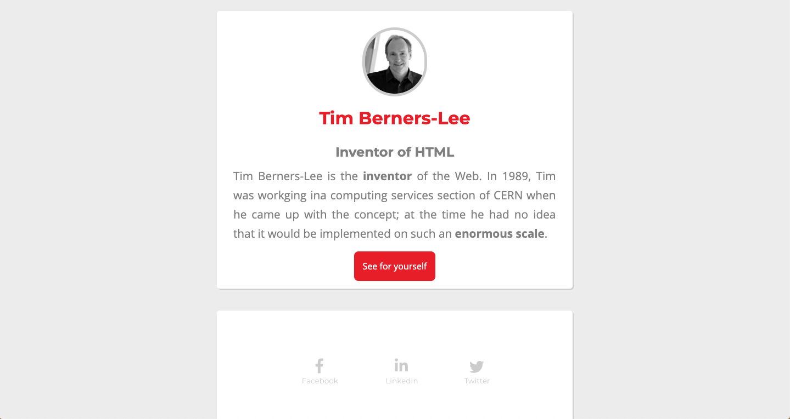

# starting-web-developpment

After the 2 weeks of training at Becode, exercise of creation of a web page on the basis of an imposed model.
We had 3 days to accomplish it.

## 1st step: 

- Creation from an existing page with, as instructions to reproduce it identically.
- Master the different CSS elements needed and set them correctly.
- Import icons from fontawesome.

## 2nd step: 

- Design responsive

## 3rd step: 

- From the "convert-to-sass" branch => removal of the CSS file and reproduce de design with SASS : th aim is to master SASS in a minimum amount of time.

## Visual:

https://ebialais.github.io/starting-web-developpment/

